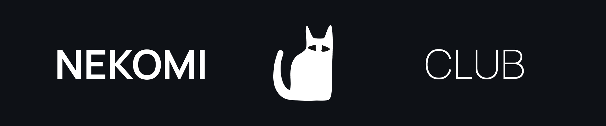

👋 Mykhailo - Web Software Engineer from Ukraine, with 2+ years of commercial experience 💸. Native Ukrainian, fluent Russian, conversational English 🐈

✒️ Design anything that can be made in Figma (websites, logos, etc)

🖥️ Self-host on a fully configured Linux machine: Nginx for HTTP, Express for responses, Cloudflare as proxy, and a Minecraft server on top 🍒

## 💻 Featured

🐈 [**nekomi.club**](https://nekomi.club) - API built with NodeJS and Express, client with Next.js, hosted on a VPS behind Cloudflare.

- [**🗨️ React modal**](https://github.com/nekomiclub/neko-popup) - The best modal package ever seen
- [**🪗 React accordion**](https://github.com/fullkekw/accordion) - Package for stacked accordion items
- [**🔗 React context menu**](http://github.com/fullkekw/fkw-menu) - Package for any taste menu (context, dropdown)
- [**🎭 React material symbols**](https://github.com/nekomiclub/material-symbols-rc) - Cool react wrapper for Google Material Symbols package
- [**💡 Yeelight agent**](https://github.com/unniiiverse/yee-ts) - Nodejs + TS implementation of Yeelight bulb API

## 👨‍💻 Skills
- JS, TS
- React, NextJS, Vite
  - 🧱 FSD architecture, SOLID
  - 🦠 Redux, PWA, Websockets, SCSS, TailwindCSS
  - 🔐 SSO authorization
- NodeJS
  - 🧱 Microservices, Onion architecture
  - 🔌 HTTP, TCP / UDP sockets. Express, Websockets
  - 🤖 Telegram bots
  - 📃 Web scrapping (puppeteer)
  - 🔐 Authorization: JWT, bcrypt, session, cookie, SSO authorization. RBAC
  - 🧪 Jest, Vitest, Supertest
  - 📽️ ffmpeg, video2x, openai whisper & chatgpt
- Git, Github, Github Actions (CI/CD pipelines)
- npm, pnpm, yarn
- RTMP, SLS live streaming
- MongoDB
- Figma
- Grafana, Prometheus
- Linux, Ubuntu, nginx, pm2 
- Cloudflare DNS, AWS, EC2, S3
- Docker

## 📩 Contacts
[Telegram](https://t.me/unniiiverse) | [Linkedin](https://www.linkedin.com/in/unniiiverse/)

*42 - meaning of life © The Hitchhiker's Guide to the Galaxy, 2005*